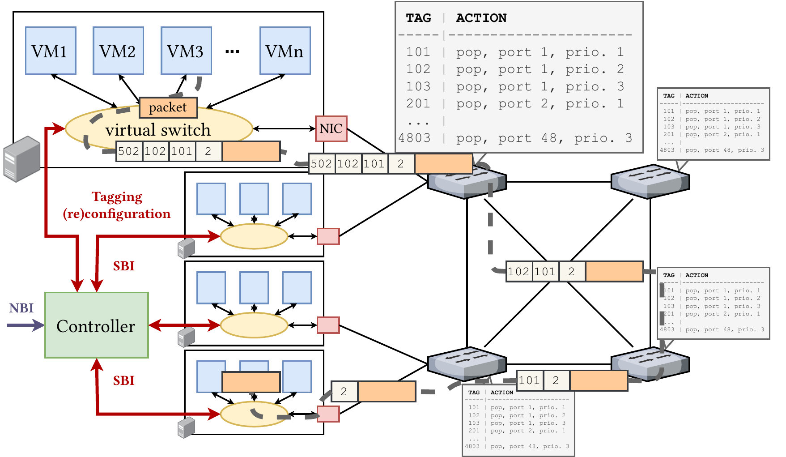
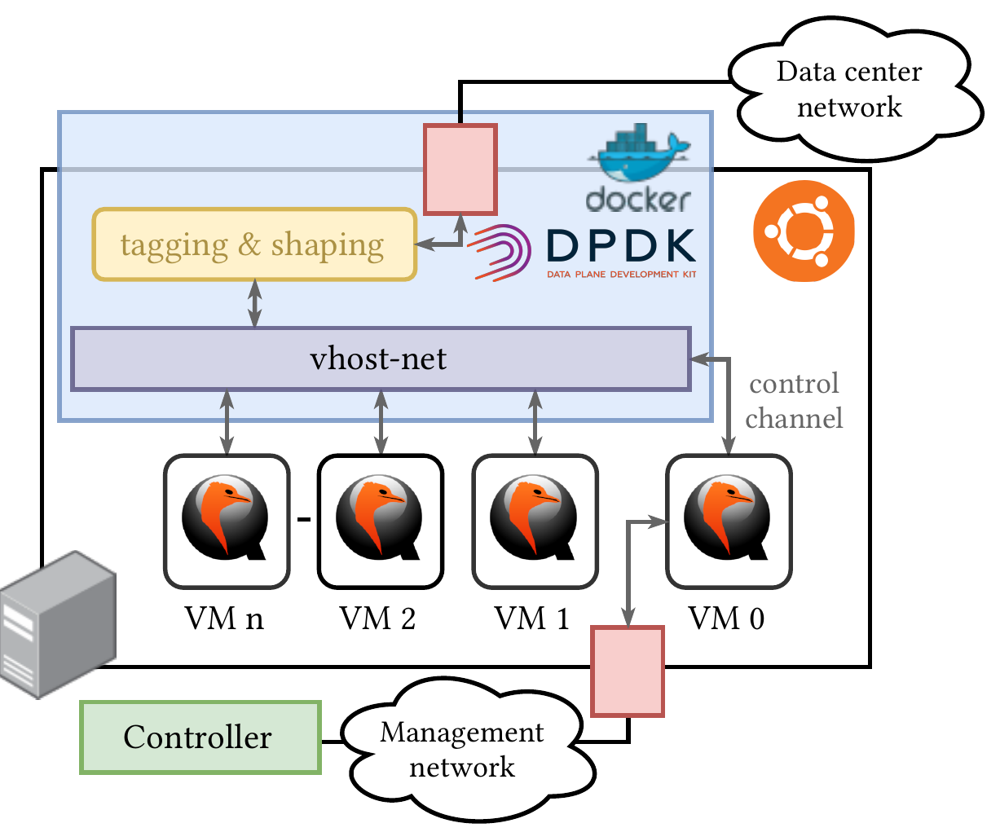

# Chameleon: end-host implementation

This repository hosts the reference end-host implementation of the **Chameleon** networking system for predictable latency in programmable networks published in:
- [Amaury Van Bemten, Nemanja Ðerić, Amir Varasteh, Stefan Schmid, Carmen Mas-Machuca, Andreas Blenk, and Wolfgang Kellerer. "Chameleon: Predictable Latency and High Utilization with Queue-Aware and Adaptive Source Routing." ACM CoNEXT, 2020](https://mediatum.ub.tum.de/doc/1577772/file.pdf).

The controller part of Chameleon is hosted in the [chameleon-controller](https://github.com/AmoVanB/chameleon-controller) repository.

## Architecture

Chameleon relies on source routing for providing predictable latency in programmable networks.
Servers (i.e., end hosts) run virtual machines (VMs) that wish to communicate with each other in the network.

Packets sent by VMs are captured in a virtual switch that is responsible for tagging (with VLAN tags) and shaping flows.
The tags the virtual switch adds correspond to the successive actions the switches in the network must take when they receive the packet.
Each time a switch receives a packet, it outputs it to a particular output port and queue based on the outermost VLAN tag and pops the latter.

The VMs on a server run in *QEMU* with *KVM*.
The virtual switch of the VMs hypervisor is implemented as a *DPDK* application running in a privileged docker container.
The VMs and the DPDK application are connected through *virtio* using a *vhost-net*/*virtio-net* para-virtualization architecture.

The virtual switch consists of a *tagging* part, responsible for pushing (VLAN) tag stacks to packets, and of a *shaping* module, responsible for ensuring that applications do not exceed their negotiated token-bucket parameters.

In order to communicate with the virtual switch without creating unpredictability and synchronization issues, we use an additional VM, the control VM (with ID 0).
The packets sent by this VM are used to configure the tagging and shaping rules of the virtual switch. 

More details about the architecture, the implementation, the goal, and the performance of Chameleon can be found in the [2020 CoNEXT article](https://mediatum.ub.tum.de/doc/1577772/file.pdf) where the system was originally published.
Section 4.2 focuses on the description of the end host implementation.

## Structure

The [install-dependencies](install-dependencies.sh) script installs all the dependencies needed on the servers and the [deploy-scripts](deploy-scripts.sh) script deploys the different Chameleon script in the `/usr/bin/` directory. These scripts are needed by the [SBI](https://github.com/AmoVanB/eces-sbi) module of the Chameleon [controller](https://github.com/AmoVanB/chameleon-controller) so that it can interact with the servers.

### `topology_discovery`

The [topology_discovery](./topology_discovery) directory contains a script for sending an LLDP packet in the network.
This script is used by the [SBI](https://github.com/AmoVanB/eces-sbi) module of the Chameleon [controller](https://github.com/AmoVanB/chameleon-controller) for topology discovery.

### `virtual_machines` 

The [virtual_machines](./virtual_machines) directory contains the scripts for creating, deleting, and listing VMs and for configuring the control VM.
The VMs are managed using *vagrant*.

The [create-base-box](./virtual_machines/create-base-box.sh) script, along with the [base-box](./virtual_machines/base-box/) directory, creates a base vagrant image that contains all the necessary software (`scapy`, `moongen`, `docker`). 
SSH keys are configured in the [vagrant-docker-vm-install](./virtual_machines/base-box/vagrant-docker-vm-install.sh) script.
Change at will so that your management PC can connect to the created VMs.

The [create-vm](./virtual_machines/create-vm.sh), [delete-vm](./virtual_machines/delete-vm.sh), and [list-vms](./virtual_machines/list-vms.sh) scripts allow to create, delete, and list the running VMs.
The VMs are identified by IDs and use `/vagrant/{VM_ID}` as vagrant working directory.
The VMs are accessible over SSH at the server's IP address and on port `20000 + {VM_ID}`.
The creation script uses the [Vagrantfile.template](./virtual_machines/Vagrantfile.template) template file and the [vagrant-docker-vm-boot](./virtual_machines/vagrant-docker-vm-boot.sh) script to create the VMs.
Upon startup, each VM runs the [send-mac-advertisement](./virtual_machines/send-mac-advertisement.py) Python script to send a dummy L2 packet to the virtual switch so that the latter learns about the MAC address of the new VM. 
The MAC address of a VM is generated by the [create-vm](./virtual_machines/create-vm.sh) script based on the hostname (hostname to MAC mappings are hardcoded in the script, change at will) of the server and the VM ID.

The [update-matching-table](./virtual_machines/update-matching-table.py) Python script is only used by the VM 0.
The script allows to directly configure the matching table of the virtual switch. 

### `virtual_switch`

The [virtual_switch](./virtual_switch) directory contains the implementation of the Chameleon DPDK tagging and shaping virtual switch, along with the scripts for running it.

The [start-dpdk-tagging](./virtual_switch/start-dpdk-tagging.sh) script starts the virtual switch in a Docker container using the [Dockerfile](./virtual_switch/Dockerfile), [build-docker](./virtual_switch/build-docker.sh), and [run-docker](./virtual_switch/run-docker.sh) files.
The [stop-dpdk-tagging](./virtual_switch/stop-dpdk-tagging.sh) stops the app.

The virtual switch C source code is located in the [app](./virtual_switch/app) directory.
The app responds to the `USR1` signal by printing out stats, and to the `USR2` signal by resetting the stats.

The [docker-scripts](./virtual_switch/docker-scripts/) directory contains the scripts to build DPDK and build and run the virtual switch DPDK app.

The [isolcpus](./virtual_switch/isolcpus/) directory contains a script to update Grub to start the kernel with the `isolcpus` parameter.

### `examples`

The [examples](./examples) directory contains an example script to use the different scripts for building the virtual switch, starting it, starting VMs that connect to it, configuring the virtual switch through VM 0, and starting traffic generation in the VMs.

The script corresponds to the PTP experiment described Section 5.4.2 of the [reference paper](https://mediatum.ub.tum.de/doc/1577772/file.pdf).

## Requirements

- In order to ensure the DPDK application runs isolated on its 3 cores, the kernel of the servers must be booted with the `isolcpus` parameters specifying the 3 cores no which the DPDK application runs (which are directly specified in the [start_app.sh script](virtual_switch/docker-scripts/start_app.sh)). The [isolcpus](./virtual_switch/isolcpus/) directory contains an example script for configuring Grub to do that.
- To avoid unpredictable performance variations, hyperthreading, turbo-boost, and power saving must be disabled in the BIOS.
